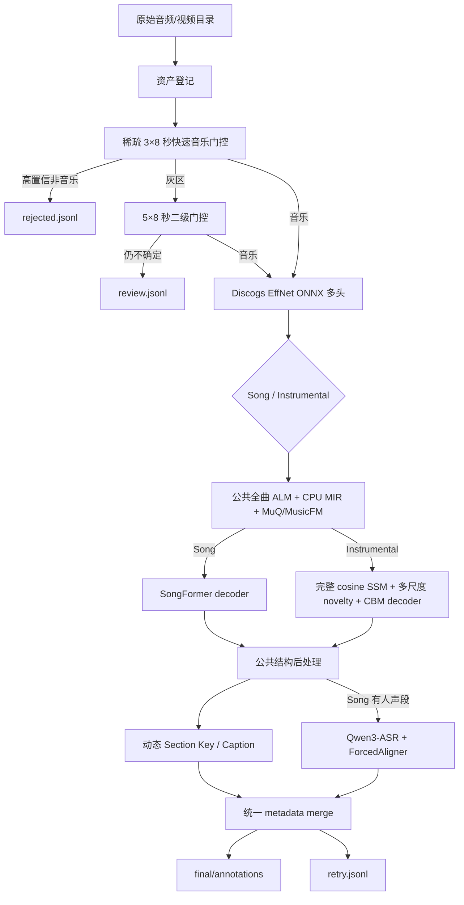

# Music-Data-Pipeline

面向 YouTube 等来源的脏音频数据清洗、理解与训练数据构建流水线。输入可以同时包含非音乐、讲话、歌曲、纯音乐、损坏媒体和视频文件；每条通过门控的音乐最终保存为一个独立 JSON，目录结构与输入相对路径一致。

新机器部署、环境安装、权重下载、单张 80GB 与独立 2×48GB Omni 服务配置见 [部署指南](docs/DEPLOYMENT_ZH.md)。

## 新流程



核心约束：

- 原始媒体只被引用，不复制、不移动，视频音轨也只在内存中解码。
- `audio_id` 是文件内容的流式 SHA256，与路径、mtime 和文件移动无关；后续合并不使用 JSONL 行号。
- SHA256 只用于内容去重和 Pipeline 内部合并；最终标注查找使用 `source_relpath`，不会重新读取音频计算哈希。
- 内容完全相同的文件只保留一个规范化 `audio_path`，其余路径记录在 `duplicate_paths`，额外副本数记录在 `duplicate_count`。
- 正式门控由随源码保存的固定 `fast_gate_config.json` 决定，Stage A 与 Stage B 均使用 PANNs MobileNet 的原生 AudioSet 概率，不训练门控头。
- Stage A 只读 10%/50%/90% 的三个 8 秒窗口；只有灰区才读 5%/25%/50%/75%/95% 的五个窗口。长音频最多解码 24 秒或累计 64 秒。
- `rejected` 与 `review` 不进入 Discogs、ALM、MuQ、MusicFM、SongFormer 或 ASR 阶段。
- Discogs backbone 每首音频只运行一次，并同时驱动 Voice、Genre、Mood/Theme、Instrument 和 Danceability 五类 head。
- Song/Instrumental 路由直接使用 Discogs 人声融合分数；默认阈值为 Song `0.55`、Instrumental `0.20`，集中配置在 `run_pipeline.sh` 顶部。
- MuQ 与 MusicFM 每张 GPU 只加载一份；`num_thread_per_gpu` 固定为 1。
- 所有 Section 音频均由 ffmpeg pipe 动态解码，不创建 `audio_seg`。
- Instrumental 永不运行 ASR；ALM prompt 明确禁止虚构歌手、歌声或歌词。
- Instrumental 结构分析计算完整 cosine self-similarity matrix（SSM），用多尺度 Foote novelty 产生候选边界，再由全局 CBM 风格动态规划选择边界，并对全部 section 做层次聚类得到 `A/B/C...`、`Intro`、`Outro` 标签。
- 结构后处理不会机械删除所有小于 8 秒的段落：`Intro/Outro/Bridge/Pre/Post-Chorus/Interlude/Break/Breakdown/Coda/Solo` 或两侧边界置信度都不低于 0.65 的 2–8 秒段会保留；小于 2 秒的毛刺仍会合并。阈值可用 `structure_postprocess.py` 的 `--minimum-duration`、`--extremely-short-duration` 和 `--short-boundary-confidence` 调整。
- Section Key 同时输出时长加权的 `diatonic_chord_duration_ratio` 与 `tonic_chord_duration_ratio`；和弦区间会在 section 边界裁剪，跨越左边界的持续和弦也会计入。
- SongFormer 默认只保存 section 级边界与标签置信度。需要逐帧调试或训练辅助数据时，可给 `SongFormer/infer_jsonl.py` 传 `--save-frame-logits-dir DIR`，把 `boundary_logits` 与 `function_logits` 保存为压缩 NPZ sidecar；不开启时不会增加主 JSONL 体积。

## 环境

保留两个隔离环境：

1. `moss-music-pipeline`（历史环境名，项目已改名）：PANNs、ONNX Runtime GPU、Chordino、BeatNet、Essentia、MuQ、MusicFM、SongFormer。
2. `qwen3-vllm`：Qwen ALM/API 客户端、Qwen3-ASR 与 ForcedAligner。

主环境还需要：

```bash
pip install onnxruntime-gpu==1.20.2 numpy scipy soundfile aiohttp tqdm
pip install torchlibrosa==0.1.0
```

系统需安装 `ffmpeg` 与 `ffprobe`。

## 权重

下载脚本只下载文件，不启动服务。默认直连并使用 `HF_ENDPOINT=https://hf-mirror.com`；只有显式设置 `HF_PROXY_URL` 才会使用代理。

```bash
bash scripts/download_weights.sh discogs
bash scripts/download_weights.sh muq wav2vec
bash scripts/download_weights.sh asr
bash scripts/download_gate_assets.sh all
```

支持目标：`muq`、`omni`、`llm`、`asr`、`wav2vec`、`discogs`、`all`。

现有权重可直接放在：

```text
SongFormer/ckpts/MuQ-large-msd-iter/
SongFormer/ckpts/MusicFM/
SongFormer/ckpts/SongFormer.safetensors
MusicToolsPipeline/discogs_onnx/
MusicToolsPipeline/checkpoints/fast_gate_config.json
MusicToolsPipeline/checkpoints/fast_gate/MobileNetV1_mAP=0.389.pth
PANNs/
```

快速门控权重也支持先放入上述目录再离线校验：

```bash
bash scripts/download_gate_assets.sh --verify all
```

PANNs MobileNetV1 会强制核对作者 Zenodo v3 发布记录中的 MD5（`a419303e1c88aa1b9d2ac3811563d371`），并记录 SHA256。文件名相同但内容不一致时会在加载模型前直接失败。

如权重位于 HF 镜像的 dataset 仓库，需同时指定 repo type；脚本仍只使用服务器网络：

```bash
HF_ENDPOINT=https://hf-mirror.com \
PANNS_MOBILENET_HF_REPO=PinnHe/ads \
PANNS_MOBILENET_HF_REPO_TYPE=dataset \
PANNS_MOBILENET_HF_FILE='ckpt/MobileNetV1_mAP=0.389.pth' \
  bash scripts/download_gate_assets.sh panns-mobilenet
```

Discogs 目录必须同时包含 dynamic-batch backbone 和五个 ONNX head 及其同名 JSON metadata。
`fast_gate_config.json` 不包含任何训练参数，并随源码固定保存。生产门控会校验 schema、固定 AudioSet 标签集合、采样策略、模型/源码 SHA256、阈值和验证指标；出现 Logistic/Platt/scaler 等拟合参数会直接拒绝启动。

## 运行

推荐直接使用仓库根目录的单一入口。第一个参数是原始音频/视频目录，第二个参数是本次结果目录：

```bash
bash run_pipeline.sh /path/to/raw_media /path/to/result
```

常用模型路径、设备、并发数、门控阈值、结构后处理阈值都集中在 `run_pipeline.sh` 最前面的 Configuration 区域，同时可以用同名环境变量临时覆盖。默认 `ALM_MODE=local`：SongFormer 释放 GPU 后 runner 会立即临时启动 Qwen3-Omni，使全曲 Caption 与尚未结束的 CPU MIR 重叠；Section Caption 完成后立即关闭 Omni，使 ASR/ForcedAligner 与尚未结束的 Section Key 重叠。runner 退出时也会清理自己启动的服务，Omni、SongFormer 和 ASR 不会同时占用同一张 GPU。

runner 管理的 GPU 阶段默认不设显存上限（`PIPELINE_GPU_MAX_MEMORY_GIB=0`），零值不会给 PyTorch allocator 设置正数上限。如需重新限制，可设置正数 GiB。Omni 按当前空闲显存动态预算 vLLM，默认保留 `VLLM_GPU_HEADROOM_GIB=4` GiB。ASR 取当前空闲显存、正数总上限和正数 ASR 上限的最小值，再扣除 ForcedAligner 8 GiB 与额外 headroom 4 GiB；剩余不足 `ASR_MIN_VLLM_MEMORY_GIB=8` GiB 时等待 GPU，超时后清晰失败。外部 ALM 服务和其他用户的任务不受 runner 控制。

CPU MIR 默认使用 8 个 Ray worker，并在子进程中隐藏 CUDA；Chordino、BeatNet 和 KeyExtractor 与 SongFormer 并行时不会创建 GPU context。

如果已有 OpenAI-compatible 音频理解服务，可改成只连接外部 API：

```bash
ALM_MODE=external \
ALM_SERVER=http://127.0.0.1:10008 \
ALM_MODEL=Qwen3-Omni-30B-A3B-Instruct \
  bash run_pipeline.sh /path/to/raw_media /path/to/result
```

`ALM_MODE=external` 默认会把 Section Key、Section Caption 和 Section ASR/ForcedAligner 并行执行；ASR 内部复用一个 ffmpeg 解码池，并在当前 GPU batch 推理时预取下一批。若外部 ALM 实际也运行在本机同一张 GPU，请设置 `PARALLEL_ASR_WITH_EXTERNAL_ALM=0`，避免显存竞争。

Section Caption 即使保持默认单请求推理，也会用独立的有界解码队列预取下一段，避免“模型生成完成后才开始解码下一段”。相关上限是 `SECTION_CAPTION_DECODE_WORKERS` 和 `SECTION_CAPTION_DECODE_BUFFER`；buffer 中只保存内存 WAV，不会产生持久化切片。

SongFormer 的每个常驻 GPU worker 同样会在当前轨进行 MuQ/MusicFM/结构推理时，用一个 CPU 线程预解码下一轨；可用 `SONGFORMER_DECODE_PREFETCH=0` 关闭并做串行对照。该优化不增加模型副本。

MuQ/MusicFM 的等长 30 秒局部块支持通过 `SONGFORMER_EMBEDDING_BATCH_SIZE` 做真实 GPU batching；不足 30 秒的尾块不补零并单独推理。默认保持 `1`，必须在目标 GPU 上完成 `1/2/4/8` 的 OOM、吞吐、embedding 和最终 section 一致性验证后，才能提高生产默认值；batch 大小进入 structure stage version，旧缓存不会混用。

没有 ALM 或 ASR 权重时可以先验证前半段：

```bash
RUN_ALM=0 RUN_SECTION_CAPTION=0 RUN_ASR=0 \
  bash run_pipeline.sh /path/to/raw_media /path/to/result
```

关闭的阶段绝不会从工作目录合入旧结果。相应字段仍保留统一 nullable schema，并标记为 `not_run`/`not_applicable`。

### 结果目录

最终可消费结果与可恢复的中间文件严格分开：

```text
RESULT_DIR/
├── final/
│   ├── review.jsonl
│   ├── rejected.jsonl
│   ├── retry.jsonl
│   └── annotations/
│       └── <输入相对目录>/<原音频完整文件名>.json
└── intermediate/
    ├── inventory/          # 资产登记与解码失败日志
    ├── routing/            # 门控、Song/Instrumental 路由和 accepted 输入
    ├── global/
    │   ├── alm/            # 全曲 caption
    │   ├── music-cpu/      # chord、beat、BPM、global key
    │   └── structure.raw.jsonl
    ├── sections/           # 后处理结构、Section Key/Caption/ASR
    ├── cache/structure/    # MuQ/MusicFM/结构断点缓存
    └── logs/               # pipeline.log 与临时 ALM 服务日志
```

例如输入 `/data/raw/album/song.mp3` 会输出 `final/annotations/album/song.mp3.json`。每个 JSON 是对应音频的完整对象，并包含 `source_relpath`。inventory 中的每个规范 `audio_id` 必须恰好属于四个互斥分区之一：成功 annotation、路由不确定 `review.jsonl`、确定拒绝 `rejected.jsonl` 或可重试失败 `retry.jsonl`。存在 retry 时 runner 正常结束，并在 `pipeline_runtime.json` 中标记 `partial_success`；基础设施错误仍非零退出。`intermediate/` 用于排错和断点恢复，不会生成持久化音频切片。

通过原始路径直接读取标注，不扫描目录、不计算 SHA：

```bash
python scripts/find_annotation.py \
  --input-root /data/raw \
  --result-dir /path/to/result \
  --audio /data/raw/album/song.mp3
```

已有旧版聚合结果可以直接拆分，无需重跑模型：

```bash
python scripts/split_annotations.py \
  --input-jsonl /old/result/final/data.annotated.jsonl \
  --input-root /data/raw \
  --result-dir /new/result
```

### 断点恢复与结果目录

资产登记使用精确完整内容 SHA256 去重，但会把文件 stat 与 SHA 缓存在 `intermediate/inventory/data.hash_cache.jsonl`，并通过 `INVENTORY_HASH_JOBS` 有界并行读取；未改变的文件在热启动时不会重复读取整首。各阶段缓存绑定真正影响计算结果的语义输入 fingerprint 与必需 payload 完整性；stage/model version 只作 provenance，不会自行触发失效。Section Key 等分段缓存还绑定 section plan/hash，边界、ID 或标签变化会重算。逐条失败写入终态 error 并留在 retry ledger，后续昂贵阶段只处理 active manifest 中的成功项；下次 resume 仅重试失败项。

## 主要阶段与文件

| 阶段 | 脚本 | 主要输出 |
|---|---|---|
| 资产登记 | `scripts/calc_duration.py` | `data.jsonl`（内容 SHA256、规范路径与重复路径） |
| 快速音乐门控 | `scripts/fast_music_gate.py` | `accepted.music.jsonl`、`review.jsonl`、`rejected.jsonl`、`failures.jsonl` |
| Discogs MIR 与路由 | `scripts/discogs_mir_infer.py` | `data.song.jsonl`、`data.instrumental.jsonl`、`review.jsonl`、`failures.jsonl` |
| 双结构 decoder | `SongFormer/infer_jsonl.py` | `structure.raw.jsonl` |
| 公共结构后处理 | `scripts/structure_postprocess.py` | `data.sections.jsonl` |
| Section Key | `scripts/section_key_infer.py` | `data.section_key.jsonl` |
| Section Caption | `scripts/section_caption_infer.py` | `data.section_caption.jsonl` |
| Section ASR | `scripts/section_asr_infer.py` | `data.section_asr.jsonl` |
| 统一合并 | `scripts/dual_metadata_merge.py` | `final/annotations/**/*.json`；失败项隔离到 `final/retry.jsonl` |
| 最终严格校验 | `scripts/validate_pipeline_output.py` | 检查四分区覆盖、语义字段、MIR、结构边界与启用阶段 payload |

所有阶段以 `audio_id`，分段字段以 `audio_id + section_id` 合并。只有所有启用阶段均成功、MIR payload 非空且 section ID、起止时间与 `[0, duration]` 覆盖有效的记录才会发布 annotation；单条缺失或失败进入 retry，不阻断其他成功音频。

## 校验

```bash
pytest -q tests

# runner 会自动执行；也可对关闭 Caption/ASR 的结果单独复核
python scripts/validate_pipeline_output.py \
  --base /path/to/result/intermediate/routing/data.song.jsonl /path/to/result/intermediate/routing/data.instrumental.jsonl \
  --inventory /path/to/result/intermediate/inventory/data.jsonl \
  --annotations-dir /path/to/result/final/annotations \
  --review /path/to/result/final/review.jsonl \
  --rejected /path/to/result/final/rejected.jsonl \
  --retry /path/to/result/final/retry.jsonl

python scripts/validate_discogs_frontend.py --device cuda:0

python scripts/validate_discogs_parity.py \
  --audio calibration/*.wav \
  --pb-backbone /path/to/discogs-effnet-bs64-1.pb \
  --pb-instrument /path/to/mtg_jamendo_instrument-discogs-effnet-1.pb \
  --onnx-root /path/to/discogs_onnx \
  --minimum-agreement 0.99

```

正式运行会先校验固定零训练配置、PANNs 源码指纹与模型 SHA256。整批门控和 Discogs 的本次运行耗时分别写入各阶段的 `runtime_metrics.json`，其中包含 `seconds_per_track` 与 `tracks_per_second`。整条 Pipeline 还会写出 `intermediate/logs/pipeline_runtime.json` 和 `stage_timings.jsonl`，记录按全部输入、accepted 音乐计算的单条耗时，以及每个逻辑阶段的实际耗时。

## 许可证

代码、模型与数据的许可证需要分别核查。权重来源、revision、运行时版本和阈值应写入每次数据生产的 manifest；商业使用前需单独完成模型和训练数据许可审查。
