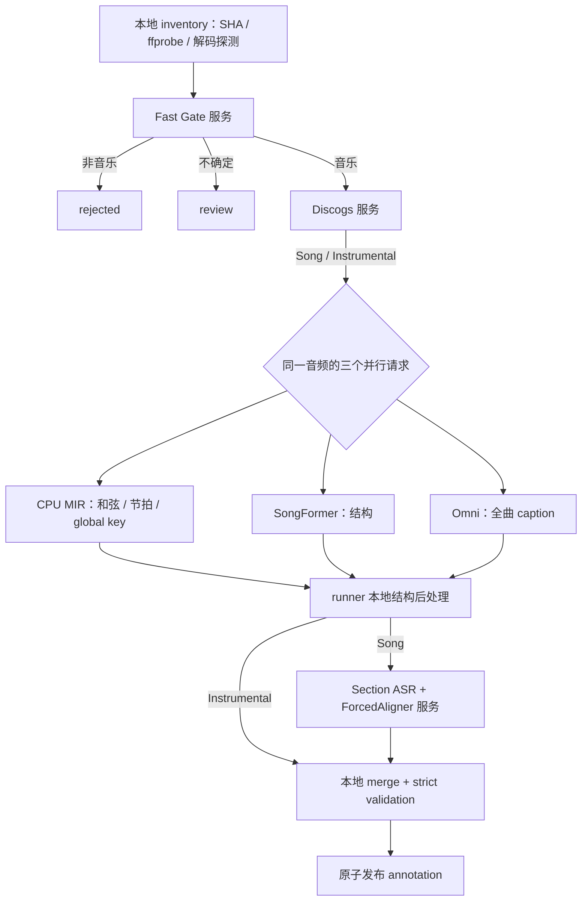

# Music-Data-Pipeline

这是一个“模型服务常驻、runner 只编排”的音频标注流水线。输入可以混合歌曲、纯音乐、非音乐、损坏媒体和视频；每条被接受的音频最终对应一个原子写入的 JSON annotation。

## 运行架构



任何会初始化模型、ONNX session、VAMP 插件或 Essentia extractor 的组件都在常驻服务中。runner 只做文件枚举、状态管理、结构后处理、合并和校验，不加载模型，也不会在服务不可用时静默回退到本地推理。

常驻服务如下：

| 服务 | 常驻内容 | 默认端口 |
|---|---|---:|
| Fast Gate | PANNs MobileNet | 18101 |
| Discogs | EffNet ONNX backbone + 5 heads | 18102 |
| CPU MIR | Chordino、BeatNet、Essentia global KeyExtractor | 18103 |
| SongFormer | MuQ、MusicFM、SongFormer | 10101 |
| Section ASR | Qwen3-ASR、ForcedAligner、vLLM | 10102 |
| Omni proxy | 连接独立 Qwen3-Omni vLLM，只做全曲 caption | 10103 |

所有服务统一提供：

- `GET /healthz`：ready、PID、启动/模型加载时间、模型指纹、CPU/RSS、GPU 显存、队列深度。
- `POST /v1/infer`：`job_id`、幂等 `request_id`、`audio_id`、共享 `audio_path`、输入指纹和上游 record。

Fast Gate、Discogs、CPU MIR、ASR 使用有界动态 batching；队列满返回 HTTP 429。SongFormer 只有一个 GPU 模型实例，在当前推理时用单线程预取下一条音频。CPU MIR 最多四个固定 worker，每个 worker 只初始化一次三类 extractor。

## 启停服务

统一管理入口支持每个服务及 `all` 的 `start/status/stop/restart`：

```bash
bash manage_model_services.sh start all --profile 80
bash manage_model_services.sh status all --profile 80
bash manage_model_services.sh restart songformer --profile 80
bash manage_model_services.sh stop all --profile 80
```

可选 profile 为 `24`、`48`、`80`。每个服务都有独立 PID、端口、日志、GPU 映射和内存配额；可用 `*_SERVICE_GPU`、`*_SERVICE_MEMORY_GIB`、`*_SERVICE_PORT` 覆盖。多机部署时，每台机器只启动自己负责的服务，runner 通过 URL 连接。

Omni 的 OpenAI-compatible vLLM engine 可以位于独立 GPU 节点。先启动上游 engine，再设置：

```bash
export OMNI_UPSTREAM_SERVER=http://omni-node:10008
bash manage_model_services.sh start omni --profile 80
```

supervisor 管理 Omni API proxy，但不会越权启停独立节点上的 vLLM。上游未 ready 时 proxy 的 `/healthz` 返回 503。

## 两种 runner

阶段式 batch：

```bash
bash run_pipeline.sh INPUT_DIR RESULT_DIR
```

它保留阶段屏障和既有输出布局，但所有模型阶段都调用常驻服务。CPU MIR、SongFormer、Omni 在同一批 accepted 数据上并行，三项完成后才进入结构后处理；ASR 只向服务提交 Song，Instrumental 由 runner 直接标记为 `not_applicable`。

逐条 streaming：

```bash
bash run_stream_pipeline.sh INPUT_DIR RESULT_DIR
```

inventory worker 每完成一条就把它交给 Fast Gate。不同音频可以同时位于不同阶段；某条 Instrumental 的三个全曲分支完成即可发布，不等待其他音频；Song 只额外等待自己的 ASR。默认最多 64 个服务请求在途。

默认本机 URL 可以用这些变量覆盖：

```bash
export FAST_GATE_SERVICE_URL=http://host-a:18101
export DISCOGS_MIR_SERVICE_URL=http://host-a:18102
export MUSIC_CPU_SERVICE_URL=http://host-b:18103
export STRUCTURE_RAW_SERVICE_URL=http://host-c:10101
export SECTION_ASR_SERVICE_URL=http://host-d:10102
export ALM_SERVICE_URL=http://host-e:10103
```

## 状态、恢复与输出

Streaming 状态数据库是：

```text
RESULT_DIR/intermediate/stream/state.sqlite3
```

SQLite 仅由 runner 写入，使用 WAL。它保存 inventory、每个 `audio_id × stage` 的输入指纹、状态、结果、错误、尝试次数、服务模型指纹、耗时和最终分区。重启时遗留的 `running` 会恢复为 `pending`；同一请求使用确定性的 request ID，连接中断可安全重试。输入发现重复 SHA256 会明确失败。

最终结果严格分为四个互斥分区：

```text
RESULT_DIR/final/
├── annotations/<输入相对路径>.json
├── review.jsonl
├── rejected.jsonl
└── retry.jsonl
```

中间数据仍位于 `intermediate/inventory`、`routing`、`global`、`sections`、`logs`；服务只返回 JSON，不写结果目录，也不保存永久音频切片。

## Annotation schema v2

`annotation_schema_version` 为 `music-data-annotation-v2`。保留：

- global key；
- Chordino 和弦时间线；
- BeatNet 节拍与下拍；
- 全曲 caption；
- section 结构；
- Song lyrics、ASR tokens 和 alignment 状态。

Section Key 和 Section Caption 已完全移除，不存在对应 section 字段、stage status/error、model version、推理脚本或缓存。旧 annotation 可直接复用已成功的全曲/结构/ASR stage cache，只重新 merge 即可迁移到 v2，无需重跑模型。

## 校验

```bash
pytest -q tests
ruff check --select F,E9 \
  --exclude PANNs --exclude SongFormer \
  --exclude MusicToolsPipeline/sub_models/beats .
```

两个 runner 在结束时都会执行四分区全局校验。最终 annotation 必须覆盖完整音频区间；Song 的 ASR section 必须完整，Instrumental 不得包含歌词或 ASR payload；任何已删除字段都会被拒绝。
